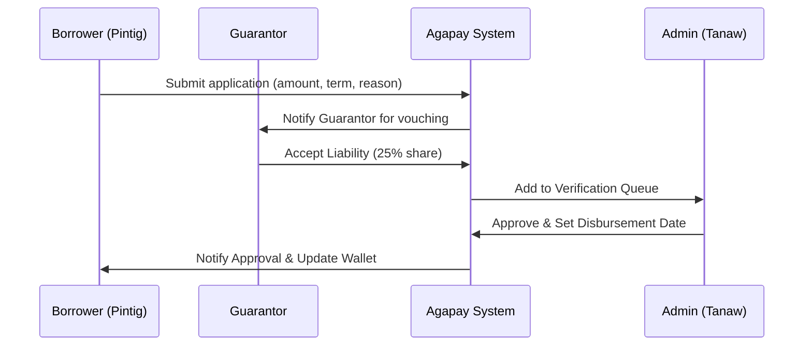
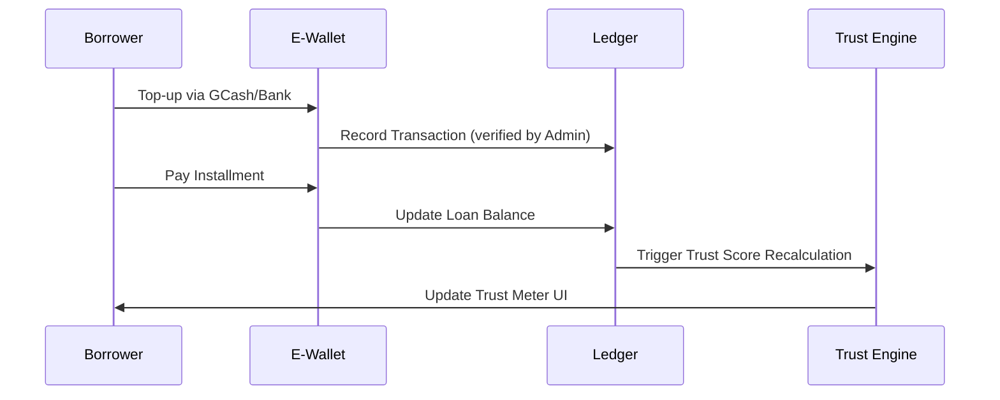

# Agapay: Multi-Tenant Microfinance SaaS Platform

**Tagline:** _Iyong Agapay, Ating Tagumpay_

---

## A. COMPANY BACKGROUND

**Agapay** (Innovative Technology for Cooperative Excellence) is a high-fidelity microfinance Software-as-a-Service (SaaS) platform tailored for Philippine credit cooperatives. Founded on the principles of **transparency, community trust, and compassion**, Agapay replaces exploitative lending practices with specialized digital ecosystems.

The platform balances technical rigor—utilizing **Next.js 15**, **Prisma 7.8**, and **Multi-schema isolation**—with human-centric logic. Agapay empowers underserved sectors (e.g., sari-sari store owners and small entrepreneurs) by professionalizing their cooperative experience through secure, localized, and socio-economically aware financial tools.

---

## B. SYSTEM OVERVIEW: THE AGAPAY LIFECYCLE

The Agapay platform operates across four primary logical phases, maintaining strict data isolation while facilitating community-driven growth.

### PHASE 1: Tenant & Member Onboarding

- **Objective**: Establish the foundation of the cooperative's digital presence.
- **Workflow**:
  - **Cooperatives** (Tenants) register through the **Agapay Platform** to provision isolated database schemas.
  - **Members** (Borrowers/Guarantors) register with **Agapay Pintig** (Member App) using multi-layer KYC.
  - **Customization**: Admins define branding (colors, logos) and hero content via the Tenant Editor.

### PHASE 2: Super Admin Verification & Approval

- **Objective**: Maintain platform-wide standards and SaaS integrity.
- **Workflow**:
  - **Global Audit**: Superadmins vet tenant documentation and subscription levels (Core, Pro, Enterprise).
  - **System Provisioning**: Automated injection of `brand_color` and `logo_url` into the multi-tenant CSS pipeline.
  - **Monetization**: Tracking lease periods and member limits per subscription plan.

### PHASE 3: Tenant Customization & Logic Tuning

- **Objective**: Configure the microfinance engine to suit local community needs.
- **Workflow**:
  - **Loan Product Studio**: Defining min/max amounts, interest rates (3%-5%), and repayment cadences.
  - **Trust Score Weighting**: Configuring the impact of payment reliability (40%), business performance (20%), peer reviews (20%), and guarantor feedback (20%).
  - **Risk Thresholds**: Establishing penalty caps (max 20%) and delinquency triggers.

### PHASE 4: Multi-Level Operations Dashboards

- **Objective**: Daily lending management, social trust updates, and financial reconciliation.
- **Workflow**:
  - **Agapay Tanaw (Admin)**: Visualizes branch health via gauging KPI meters and AI-generated snapshots.
  - **Agapay Pintig (Member)**: Real-time wallet monitoring, loan applications, and peer-to-peer vouching.

---

## C. CORE BUSINESS ENGINES (DEEP DIVE)

<details>
<summary><b>1. Socio-Economic Trust Engine 1.0</b></summary>

Agapay utilizes a weighted reputation system (1.0 to 5.0) that directly influences borrowing power.

- **Formula**: `Trust Score = (Payment_Reliability * 0.4) + (Business_Health * 0.2) + (Peer_Rating * 0.2) + (Guarantor_Vouch * 0.2)`
- **Vouching System**: Members can "vouch" for one another. If a member defaults, the trust score of all their vouchers is negatively adjusted by a fixed multiplier, encouraging responsible community endorsements.
- **Incentives**: High trust scores unlock the **Elite Tier** (₱100k+ limits) and **Declining Balance** interest models.

</details>

<details>
<summary><b>2. Multi-Tenant Isolation & Security</b></summary>

The platform uses a **Schema-per-Tenant** isolation strategy within a unified PostgreSQL database.

- **Isolation Mechanism**: Agapay uses a custom Prisma Proxy (`proxy.ts`) to execute `SET LOCAL app.tenant_id` before every mutation. Row-Level Security (RLS) ensures that no cross-tenant data leaks can occur.
- **Identity Model**: Users are uniquely identified by a combination of `(email, tenant_id)`. This allows the same person to belong to multiple cooperatives with separate histories and trust scores.
- **Authentication**: JWT-based sessions are scoped to a specific `tenant_id`, enforced at the Middleware level.

</details>

<details>
<summary><b>3. Compassion Policy & Crisis Management</b></summary>

Agapay is the first platform to include a built-in **Compassion Policy** for natural disasters or medical emergencies.

- **Triggers**: Admins can declare a "Compassion Window" for specific member groups.
- **Actions**: Automated suspension of penalty accumulation and 1-2 week grace periods for installments.
- **Tracking**: All compassion actions are recorded in the audit logs to prevent administrative abuse.

</details>

---

## D. OPERATIONAL WORKFLOWS

### Loan Application & Approval Flow



### Repayment & Trust Update Flow



---

## E. USER ROLE & FEATURE MATRIX

| Feature                | Superadmin |   Tenant Admin   | Member |
| ---------------------- | :--------: | :--------------: | :----: |
| **Platform Analytics** |     ✅     |        ❌        |   ❌   |
| **Tenant Onboarding**  |     ✅     |        ❌        |   ❌   |
| **EOD Reconciliation** |     ❌     |        ✅        |   ❌   |
| **Loan Approvals**     |     ❌     |        ✅        |   ❌   |
| **Wallet Management**  |     ❌     |        ✅        |   ✅   |
| **Loan Applications**  |     ❌     |        ❌        |   ✅   |
| **Social Vouching**    |     ❌     |        ❌        |   ✅   |
| **Audit Log View**     |     ✅     | ✅ (Branch only) |   ❌   |

---

## F. TECHNICAL REFERENCE (The Agapay API)

Agapay exposes a robust REST API for native integration. Base URL: `https://agapay-saas.vercel.app/api/v1`

### Authentication (`/auth`)

- `POST /login`: Returns JWT and tenant context.
- `POST /register`: Multi-pane KYC submission.

### Financials (`/loans`, `/users/wallet`)

- `GET /loans/products`: Lists products eligible for the user's current trust tier.
- `POST /loans/apply`: Submits application with guarantor references.
- `POST /users/wallet/pay-loan`: Direct settlement from wallet balance.

> **Technical Docs**: See the [Full API Reference](./src/app/api/v1/README.md) for endpoint schemas and Android/Web code examples.

---

## G. DEVOPS & INFRASTRUCTURE

### Prerequisites

- **Node.js**: v18.x or v20.x (Recommended)
- **Database**: PostgreSQL with Multi-Schema support
- **Storage**: Vercel Blob or AWS S3 (for ID document uploads)

### Rapid Deployment

```bash
# 1. Install dependencies
npm install

# 2. Synchronize Schemas & RLS
npx prisma migrate dev
npx prisma generate

# 3. Seed Multi-Tenant Context
npm run db:reset

# 4. Start Development Server (Turbopack)
npm run dev
```

### Environment Configuration

| Key                 | Purpose                                   |
| ------------------- | ----------------------------------------- |
| `DATABASE_URL`      | Primary MySQL connection string           |
| `NEXTAUTH_SECRET`   | Session encryption key                    |
| `AGAPAY_CRYPTO_KEY` | Key for encrypting sensitive ID documents |

---

## 📂 ARCHITECTURE & DIAGRAMS

- [System Diagrams (DFD & Use Case)](./docs/SYSTEM_DIAGRAMS.md)
- [Product Requirements (PRD)](./docs/PRD.md)
- [Architecture Policy](./docs/ARCHITECTURE.md)

---

_Proprietary - © 2026 Agapay Technology Solutions. Documentation aligned with ITME Multi-Tenancy Finals standards._
