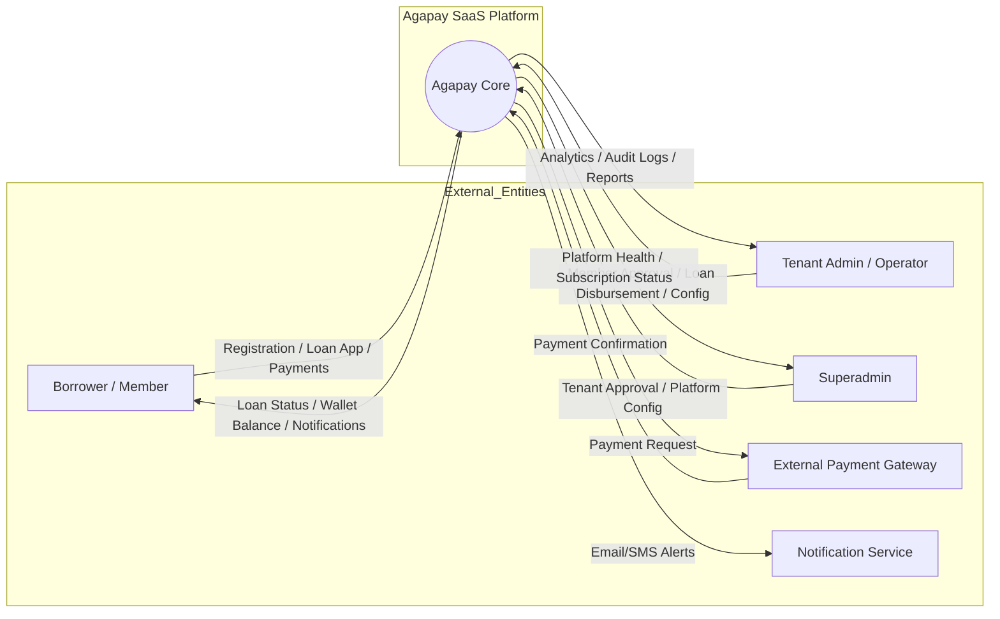
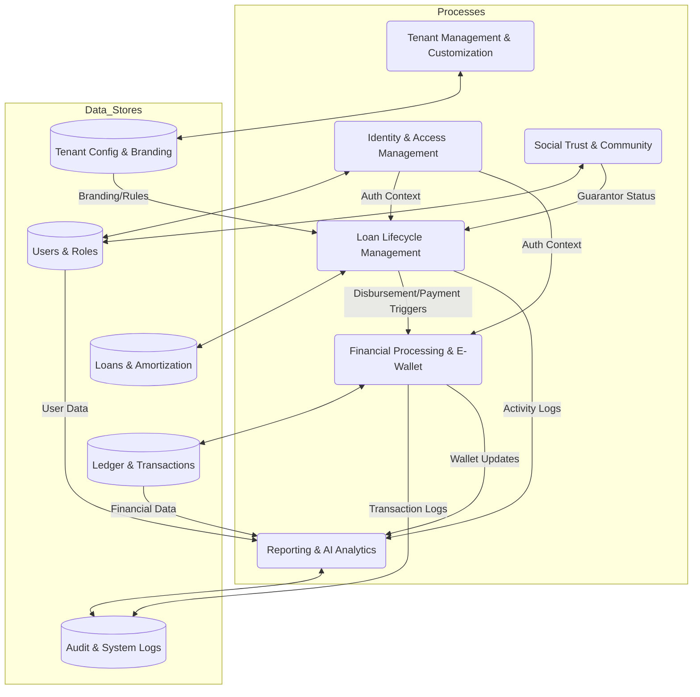

# Agapay System Architecture Diagrams

This document provides visual representations of the Agapay Multi-Tenant Microfinance SaaS platform's data flows and user interactions.

---

## 1. Data Flow Diagram (DFD) Level 0: Context Diagram

The Context Diagram defines the system boundaries and its interactions with external entities.



---

## 2. Data Flow Diagram (DFD) Level 1: Functional Decomposition

Level 1 breaks down the core system into specialized processes and data stores.



---

## 3. Use Case Diagram

The Use Case Diagram illustrates the functional requirements from the perspective of different system actors.

```mermaid
useCaseDiagram
    actor "Borrower" as B
    actor "Tenant Admin" as TA
    actor "Superadmin" as SA

    package "Agapay Platform" {
        usecase "Register & KYC" as UC1
        usecase "Apply for Loan" as UC2
        usecase "Vouch for Peer (Guarantor)" as UC3
        usecase "Manage Wallet (Top-up/Pay)" as UC4
        usecase "View Amortization" as UC5
        
        usecase "Verify Member Documents" as UC6
        usecase "Approve/Disburse Loan" as UC7
        usecase "Configure Loan Products" as UC8
        usecase "Reconcile Treasury" as UC9
        
        usecase "Approve Tenant Branch" as UC10
        usecase "Monitor Platform Health" as UC11
        usecase "Audit System Logs" as UC12
    }

    B --> UC1
    B --> UC2
    B --> UC3
    B --> UC4
    B --> UC5

    TA --> UC6
    TA --> UC7
    TA --> UC8
    TA --> UC9
    
    SA --> UC10
    SA --> UC11
    SA --> UC12

    %% Relationships
    UC7 ..> UC2 : <<include>>
    UC4 ..> UC5 : <<extend>>
```

---

## 4. Key Data Entity Mapping (Referencing User ERD)

| Process | Key Tables Involved |
|---|---|
| **Onboarding** | `users`, `documents`, `tenants` |
| **Lending** | `loans`, `loan_products`, `loan_schedules`, `loan_guarantees` |
| **Repayment** | `payments`, `business_ledger`, `ledger_accounts` |
| **Compassion** | `compassion_actions` |
| **Audit** | `audit_logs` |
| **Communication** | `messages` |

---

*Visualization version: 1.0 (Based on Multi-Tenant Resiliency PRD)*
